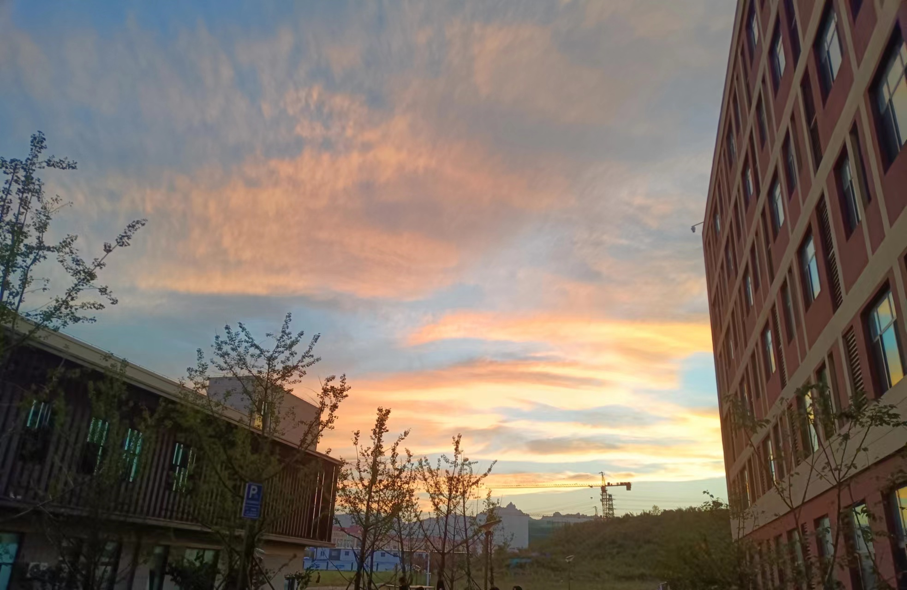
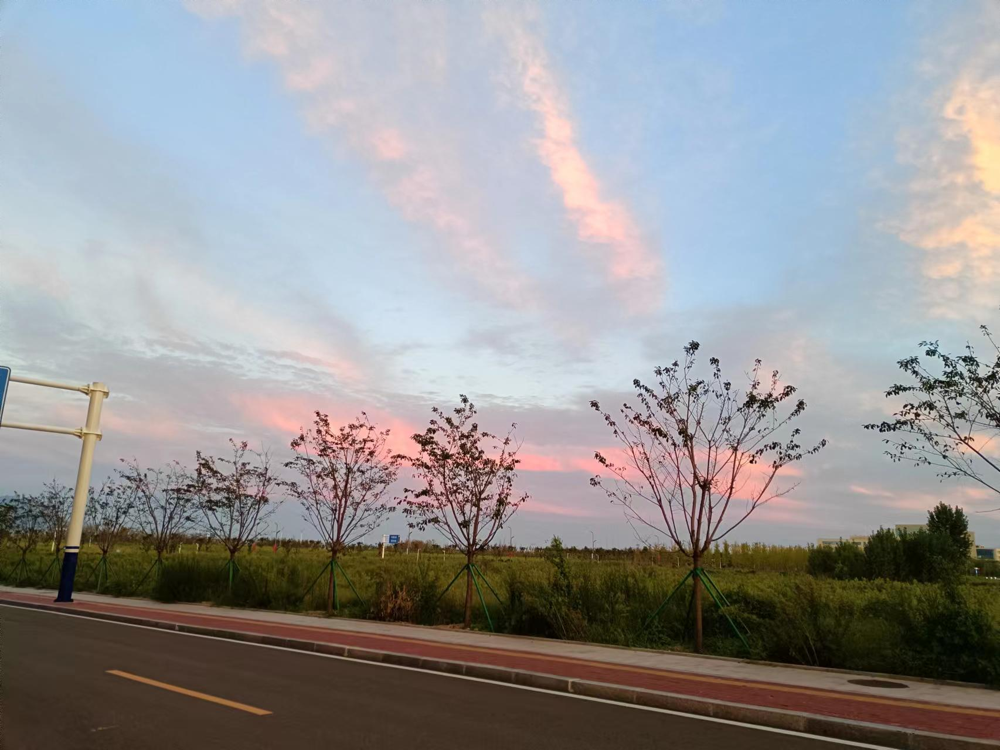
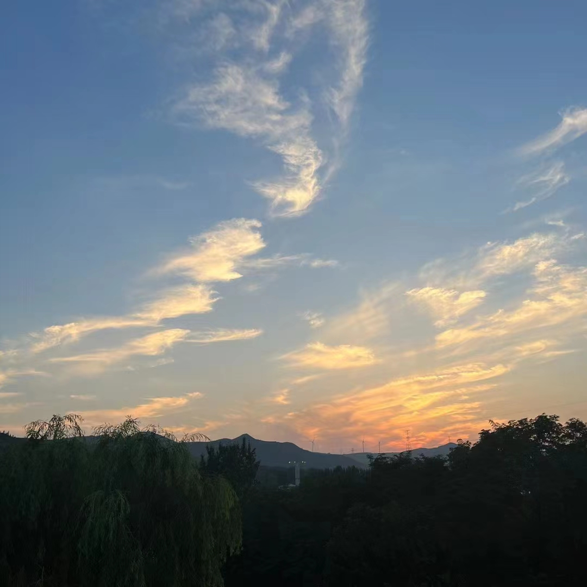

# welcome to my homepage

<table>
  <tr><td>

  ### 个人介绍
  
  
&emsp;&emsp;姓名：常静

  
&emsp;&emsp;兴趣爱好：考了电子琴十级证书，闲来无事喜欢弹弹钢琴；世界上没有人会不喜欢听歌吧？喜欢聊天，超级能聊但是社恐（真羡慕e人啊）

  
&emsp;&emsp;分享一下会让我感觉很美好的云朵

<table>
  <tr>
    <td></td>
    <td></td>
    <td></td>
  </tr>
</table>
 </td></tr>
<tr><td>

  ### 成就

  
&emsp;&emsp;学习:平平无奇且远远不如别人努力所以编程能力一般，更喜欢前端；没有比赛成就，只是苟了单项奖学金

  
&emsp;&emsp;其他:在崂山参加合唱团，在西海岸参加阿卡贝拉，主要在大一参加了好多活动但只是参加而已

  </td></tr>
  <tr><td>

  ### 规划

&emsp;&emsp;考教资，考研成功继续考公，考研失败直接考公，考公失败就去当老师，当不了老师再考虑其他行业

</table>

